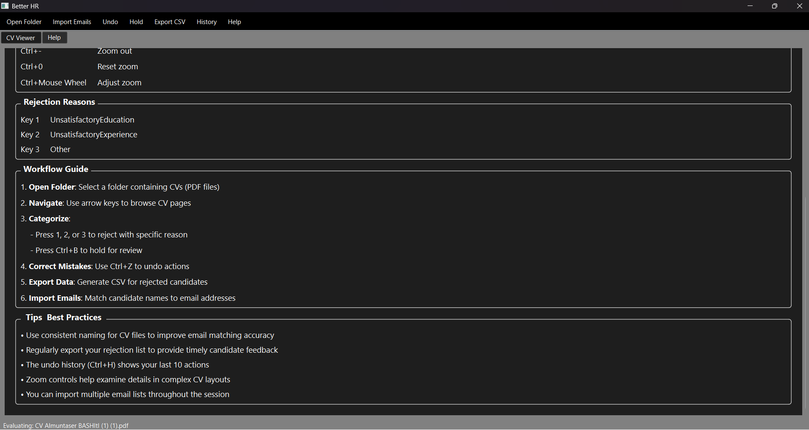

# Better HR - Transparent CV Review Tool

 *Example screenshot of Better HR in action*

Better HR is an open-source desktop application designed to revolutionize the CV review process by enabling HR professionals to provide transparent rejection reasons to candidates. This tool helps organizations move beyond generic rejection emails by capturing specific feedback during the review process.

## Key Features

- 🗂️ **PDF CV Viewer**: View and navigate CVs with keyboard shortcuts
- 🏷️ **Reason-Based Categorization**: Reject CVs with specific reasons (Unsatisfactory Education, Experience, or Other)
- 📥 **Email Integration**: Import candidate emails and match them to CVs
- ⏮️ **Unlimited Undo**: Correct mistakes with multi-level undo history
- 🔍 **Zoom Controls**: Examine CV details with adjustable zoom
- 📊 **CSV Export**: Generate rejection reports with reasons and emails
- 💾 **Session Persistence**: Auto-save your work and recover after crashes
- ❓ **Comprehensive Help**: Built-in documentation with key bindings

## Why Better HR?

Traditional HR processes often leave candidates in the dark with generic rejection emails. Better HR solves this by:

1. Capturing specific rejection reasons during review
2. Matching candidates to their contact information
3. Generating exportable reports for personalized feedback
4. Creating an audit trail of review decisions
5. Promoting fairness and transparency in hiring

## Installation

### Prerequisites
- Python 3.11+
- PySide6
- PyMuPDF (fitz)

### Installation Steps

```bash
# Clone the repository
git clone https://github.com/yourusername/better-hr.git
cd better-hr

# Create virtual environment (recommended)
python -m venv venv
source venv/bin/activate  # Linux/Mac
venv\Scripts\activate    # Windows

# Install dependencies
pip install -r requirements.txt

# Run the application
python main.py
```

## Usage

### Basic Workflow
1. **Open Folder**: Select a folder containing PDF CVs
2. **Review CVs**: Navigate with arrow keys
3. **Categorize**:
   - Press 1, 2, or 3 to reject with specific reason
   - Press Ctrl+B to hold for review
4. **Correct Mistakes**: Ctrl+Z to undo actions
5. **Export Data**: Generate CSV with rejection reasons
6. **Import Emails**: Match candidate names to email addresses

### Key Bindings
| Key Combination | Action |
|----------------|--------|
| → | Next page |
| ← | Previous page |
| 1, 2, 3 | Reject with reason |
| Ctrl+Z | Undo last action |
| Ctrl+B | Hold for review |
| Ctrl+H | Show undo history |
| Ctrl+O | Open folder |
| Ctrl+I | Import emails |
| Ctrl+E | Export CSV |
| F1 | Show help |
| Esc | Return to main view |
| Ctrl++ | Zoom in |
| Ctrl+- | Zoom out |
| Ctrl+0 | Reset zoom |
| Ctrl+Mouse Wheel | Adjust zoom |

## Configuration

Better HR stores configuration in `config.json` with the following structure:

```json
{
  "reason_map": {
    "1": "UnsatisfactoryEducation",
    "2": "UnsatisfactoryExperience",
    "3": "Other"
  },
  "hold_folder": "HoldForReview",
  "email_map": {},
  "max_undo": 100,
  "default_zoom": 1.5
}
```

You can customize:
- Rejection reasons and their keys
- Folder name for held CVs
- Default zoom level
- Maximum undo history size

## Technical Details

### File Structure
```
better-hr/
├── main.py            # Main application entry point
├── config.json        # Configuration file
├── session_state.json # Auto-saved session state
├── requirements.txt   # Python dependencies
└── README.md          # This documentation
```

### Dependencies
- PySide2: Qt-based GUI framework
- PyMuPDF (fitz): PDF rendering library
- Standard Python libraries: sys, os, glob, shutil, csv, json, re, atexit, tempfile

## Contributing

We welcome contributions! Here's how to help:

1. Report bugs or suggest features in the Issues section
2. Fork the repository and create a pull request
3. Improve documentation and translations
4. Share your success stories using Better HR


---

**Help us create a world where every candidate receives meaningful feedback!**